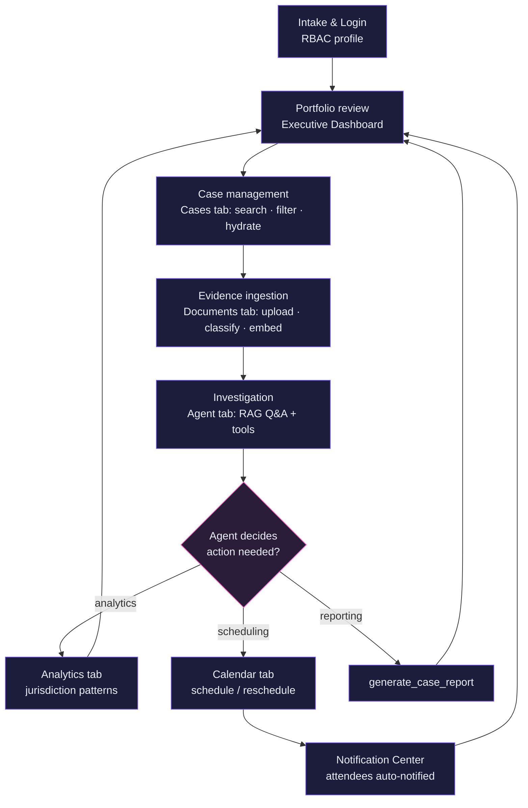
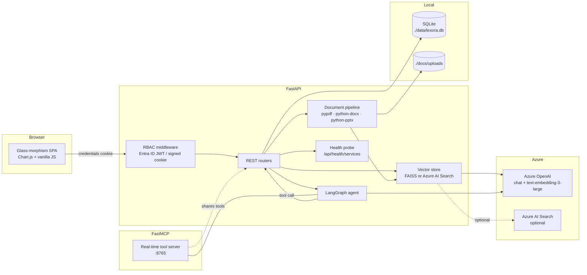
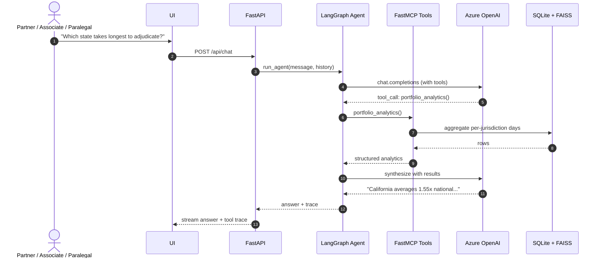
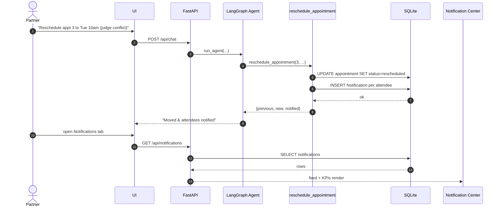

# LEXORA

> **Litigation Lifecycle, illuminated.**
> An Azure-native, agentic case-management platform for a top-tier law firm —
> built for the Troutman / Mays & Valentine CIO demo.

`LEX` *(law)* + `AURORA` *(illumination)* = **LEXORA** — one word, one promise:
shine intelligent, agentic light across every stage of the litigation lifecycle.

---

## ✨ What it does

| Capability | How |
|---|---|
| **Ingestion** of PDF / DOCX / PPTX / JSON / TXT / MD | Streaming upload → token-aware chunking → Azure OpenAI embeddings → FAISS (or Azure AI Search) |
| **RAG Q&A** over the firm's documents | LangGraph ReAct agent + Azure OpenAI chat model + semantic retrieval with citations |
| **Real-time tool use** (no hard-coded answers) | FastMCP server exposes the same tools used by the agent — every call hits SQLite / FAISS / Azure live |
| **Action-taking** — reschedule appointments, send notifications, generate reports | Each is a real DB mutation, an audit-log entry, and (in prod) an outbound dispatch |
| **Notification Center** | Live activity feed of every queued/sent notification with KPIs, channel/status filters, and relative timestamps |
| **Executive dashboard** + analytics | KPIs, doughnut/bar/line charts, monthly-filings trend, value-by-practice |
| **Pattern detection** | Surfaces the headline insight: *California cases run materially longer than the national average* |
| **Tenant RBAC** (key-auth disabled) | Entra ID bearer tokens *or* signed-cookie demo profiles; route handlers enforce role hierarchy |
| **Service health probe** | `GET /api/health/services` reports DB / Azure OpenAI / Search / vector-store / MCP status |
| **UI** | Glass-morphism, dark default + light toggle, modern header, pinned centered footer |

---

## 🔄 Litigation lifecycle process flow

LEXORA mirrors how a matter actually moves through the firm — every stage maps
to a feature in the app.



**Closed loop:** every action (reschedule, notify, report) returns the user to
the portfolio view, and every state change is persisted + audited — so the
lifecycle is fully traceable end-to-end.

---

## 🏗️ Architecture



### Why a shared tool registry?

`app/agent/tools.py` defines every tool **once**. The LangGraph agent wraps
them as LangChain `StructuredTool`s, and `app/mcp/server.py` registers the
same callables with FastMCP. Result: any MCP client (Claude Desktop, an IDE
agent, another LangGraph instance) controls LEXORA with identical semantics
— and there is zero drift between the two surfaces.

---

## 🔁 Workflow



### Action-taking loop (reschedule → notify)

This is the loop that lands for executives — the agent doesn't just *answer*,
it *acts*, and the action is visible in the Notification Center.



### Document ingestion (performance-tuned)

1. **Streaming upload** to `./docs/uploads/<ts>_<name>` (no full-file buffering).
2. DB row inserted **immediately** with `status=Processing…` → UI shows progress.
3. Heavy parse/classify/summarize/embed dispatched to a **`BackgroundTask`** thread.
4. Per-type extractors:
   * PDF: `pypdf` per-page
   * DOCX: heading-aware sectioning
   * PPTX: slide-by-slide
   * JSON / TXT / MD: passthrough
5. **Token-aware chunking** via `tiktoken cl100k` — `MAX 600 tokens · 80 overlap`.
6. Embeddings **batched** (64 chunks per Azure OpenAI call).
7. Cosine via `IndexFlatIP` on L2-normalised vectors.
8. Local FAISS index persists to `./data/vector_index/` — swap to Azure AI Search by setting `AZURE_SEARCH_ENDPOINT`.

---

## 🎨 Design

* **Flat visual system** — solid surfaces and clean borders (no glass blur effects).
* **Light theme by default**; toggle button (top-right header & login) swaps between light and dark and persists in `localStorage`.
* **Header**: solid logo mark, brand wordmark, central nav tabs.
* **Footer**: pinned to the viewport bottom, centered text `CREATED BY | CHINMOY C.`
* **Charts**: Chart.js — doughnut, bar, and polar-area portfolio visuals.
* **Drag-and-drop dropzone** with hover state, queued-upload list, real-time progress.
* **Accessibility-friendly contrast** in both themes; transitions tuned to 220 ms.

---

## 🔐 Authentication & Authorization

Key-based authentication is **disabled tenant-wide**, so every Azure call uses
**`DefaultAzureCredential`** (Managed Identity in prod, `az login` locally,
VS Code credential in dev). Required role assignments on the principal:

| Resource | Role |
|---|---|
| Azure OpenAI | `Cognitive Services OpenAI User` |
| Azure AI Search (optional) | `Search Index Data Contributor` |
| (Optional) Storage / Key Vault | Standard data plane roles |

User authentication has two interchangeable paths (see `app/auth.py`):

1. **Production**: client presents an Entra ID bearer token issued for `AZURE_CLIENT_ID`. The backend decodes claims, asserts the `tid` matches `AZURE_TENANT_ID`, and uses the `roles` claim for RBAC.
2. **Demo** (`DEMO_MODE=true`): the login screen offers four role profiles. Selecting one issues a signed (`itsdangerous`) cookie that the same `current_principal` dependency consumes. This lets you showcase role-gated behaviour without provisioning Entra app roles.

Role hierarchy enforced by `require_roles(...)`:

```
Admin   ⊇ Partner ⊇ Associate ⊇ Paralegal
Client  (isolated; external view)
```

Every state-changing tool / endpoint writes to `audit_log` with actor email + role.

---

## 🧰 MCP tools (live, not mocked)

| Tool | Purpose |
|---|---|
| `search_cases` | Free-text + filter search over the case portfolio |
| `get_case_detail` | Full hydrate (docs, appts, notes) for one case |
| `query_documents` | Semantic RAG retrieval with filename + page citations |
| `list_upcoming_appointments` | Calendar lookahead |
| `schedule_appointment` | Create on calendar |
| `reschedule_appointment` | Move + auto-notify attendees |
| `send_notification` | Queue email / SMS / in-app |
| `generate_case_report` | Structured report dict |
| `portfolio_analytics` | KPIs + distributions + detected patterns |

> Notifications created by `send_notification` and `reschedule_appointment` are
> surfaced live in the **Notification Center** tab (`GET /api/notifications`).

Connect any MCP client to `http://127.0.0.1:8765` (HTTP transport) or
`python -m app.mcp.server --stdio` (stdio transport).

---

## 🚀 Run

```powershell
# 1. Create venv & install
python -m venv .venv
.\.venv\Scripts\Activate.ps1
pip install -r requirements.txt

# 2. Configure
copy .env.example .env
# edit .env: AZURE_OPENAI_ENDPOINT, deployments, AZURE_TENANT_ID, AZURE_CLIENT_ID

# 3. Sign in to Azure (RBAC; no keys needed)
az login

# 4. Launch (API + FastMCP)
python run.py
```

Open <http://localhost:8000/login>, pick a profile (e.g. **Harini Patel — Partner**),
and you land on the Executive Dashboard.

The SQLite DB seeds itself on first start with **30 cases across 8 US
jurisdictions**, deliberately skewed so California shows a measurably longer
average adjudication time.

---

## 📁 Project layout

```
troutuc/
├── .env / .env.example
├── requirements.txt
├── run.py                          # API + MCP launcher
├── README.md
├── data/                           # SQLite + FAISS index (gitignored)
├── docs/                           # uploaded files (gitignored)
├── app/
│   ├── main.py                     # FastAPI app
│   ├── config.py                   # pydantic-settings
│   ├── auth.py                     # RBAC (Entra ID + demo cookie)
│   ├── azure_clients.py            # DefaultAzureCredential helpers
│   ├── database.py                 # SQLAlchemy engine
│   ├── models.py                   # ORM
│   ├── seed.py                     # mock data
│   ├── document_processor.py       # PDF/DOCX/PPTX/JSON pipeline
│   ├── vector_store.py             # FAISS + Azure AI Search bridge
│   ├── analytics.py                # KPIs + pattern detection
│   ├── agent/
│   │   ├── tools.py                # shared tool registry
│   │   └── graph.py                # LangGraph workflow
│   ├── mcp/server.py               # FastMCP server
│   └── routers/                    # FastAPI routers
└── frontend/
    ├── index.html / login.html
    ├── css/styles.css              # flat UI + theme tokens
    └── js/                         # theme, app, dashboard, cases, documents,
                                     # chat, analytics, calendar, notifications
```

---

## 🧪 Demo script (5 min)

1. **Login** as *Harini Patel — Partner*. Dashboard greets her with KPIs +
   four charts + AI-detected patterns. Point out the *California pattern* card.
2. **Switch theme** with the sun/moon toggle. The app restyles live between
   light and dark themes.
3. **Cases** tab → filter `California` + `Critical`. Click a row → full hydrate
   panel with documents / appointments / notes.
4. **Documents** tab → drag in a real PDF. Watch the queued row, then refresh
   to see auto-classification, page count, and LLM summary appear.
5. **Agent** tab → ask *"Which state takes the longest to adjudicate, and what
   are the top contributing case types?"*. Observe the `🛠 portfolio_analytics`
   tool badge under the answer.
6. **Calendar** tab → reschedule an appointment via the custom date/time
   picker; toast confirms attendees were notified (`Notification` rows persisted).
7. **Notifications** tab → hit **Refresh**: the messages generated by the
   reschedule appear at the top of the activity feed with recipient, channel,
   case, and relative time — proving the agent took a real, auditable action.
8. **Analytics** tab → horizontal-bar + doughnut visuals, Δ-vs-national pills.

---

**CREATED BY | CHINMOY C.**
