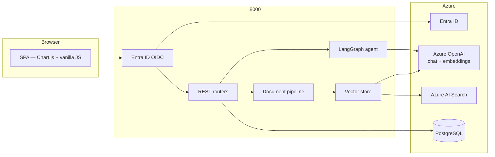

# LEXORA

> **Litigation Lifecycle, illuminated.**
> An Azure-native, agentic case-management platform built for law firm demos.

`LEX` *(law)* + `AURORA` *(illumination)* = **LEXORA**

---

## What it does

| Capability | How |
|---|---|
| **Document ingestion** — PDF / DOCX / PPTX / JSON / TXT / MD | Upload → token-aware chunking → Azure OpenAI embeddings → Azure AI Search |
| **RAG Q&A** over firm documents | LangGraph ReAct agent + Azure OpenAI + semantic retrieval with citations |
| **Action-taking agent** — reschedule, notify, report | Every call is a real DB mutation with an audit-log entry |
| **Executive dashboard + analytics** | KPIs, charts, monthly trends, practice-area breakdowns |
| **Pattern detection** | Statistical + LLM-hybrid engine surfaces jurisdiction-level insights |
| **Tenant RBAC** | Entra ID app roles (Admin / Partner / Associate / Paralegal / Client) |
| **Service health probe** | `GET /api/health/services` — DB / Azure OpenAI / AI Search / vector store |

---

## Architecture

```
Browser (vanilla JS SPA)
  → FastAPI (:8000)
      → auth.py            — Entra ID OAuth2 + signed session cookie
      → entra.py           — MSAL auth URL / code exchange / JWKS verification
      → agent/graph.py     — LangGraph ReAct agent
      → analytics.py       — KPIs, statistical + LLM pattern detection
      → document_processor.py  — extract / classify / summarize
      → vector_store.py    — Azure AI Search (or no-op if unconfigured)
      → database.py        — SQLAlchemy (PostgreSQL prod / SQLite local)
  → app/mcp/server.py      — FastMCP subprocess (:8765, disabled in ACA)
```



### Non-obvious patterns

**Single TOOL_REGISTRY** — `app/agent/tools.py` defines every tool once. The LangGraph agent wraps them as `StructuredTool` instances; `mcp/server.py` registers the same callables with FastMCP. Never add a tool to one without the other.

**Lazy cached singletons** — `get_settings()`, all Azure clients, and the compiled LangGraph graph are `@lru_cache`. They initialize on first call. Mutating settings at runtime won't work.

**Dual-mode database** — `database.py` detects the `DATABASE_URL` prefix: `sqlite` gets `check_same_thread=False`; anything else gets `pool_pre_ping=True` for PostgreSQL. Default is SQLite for local dev.

**Demo mode** — `DEMO_MODE=true` enables a fake login page with preset role profiles. Production (`DEMO_MODE=false`, the default) requires a real Entra ID login and redirects automatically — no button click.

**MCP disabled in ACA** — The FastMCP subprocess runs on `:8765` locally but is disabled in the container (`python run.py --no-mcp`). Port 8765 is not reachable via ACA ingress.

---

## Authentication

Authentication uses the **Entra ID OAuth2 authorization code flow** (`app/entra.py`, `app/routers/auth.py`).

**Flow:**
1. User visits `/` → redirected to `/api/auth/login`
2. `/api/auth/login` → redirects to `https://login.microsoftonline.com/{tenant}/oauth2/v2.0/authorize`
3. After login, Entra ID redirects to `/api/auth/callback`
4. Callback exchanges the code via MSAL, validates `tid` claim, extracts app roles, sets a signed `itsdangerous` session cookie
5. User lands on `/` — all subsequent requests are authenticated via the cookie

**App roles** (defined in the Azure App Registration, assigned per user/group):

| Entra ID role value | App role |
|---|---|
| `App.Admin` | Admin — full access |
| `App.Partner` | Partner — can delete documents |
| `App.Associate` | Associate |
| `App.Paralegal` | Paralegal |
| `App.Client` | Client — read-only |

Role hierarchy: `Admin ⊇ Partner ⊇ Associate ⊇ Paralegal`. `Client` is isolated (read-only).

**Azure portal setup required:**
- App Registration → Authentication → **Web** platform (not SPA) with redirect URI `https://<host>/api/auth/callback`
- Enable **ID tokens** under implicit grant
- Define app roles matching the values above
- Grant ACA managed identity `Cognitive Services OpenAI User` (Azure OpenAI) and `Search Index Data Contributor` (Azure AI Search)

---

## Local development

```bash
# 1. Create venv and install
python -m venv .venv
.\.venv\Scripts\Activate.ps1
pip install -r requirements.txt

# 2. Configure
copy .env.example .env
# Required: AZURE_OPENAI_ENDPOINT, AZURE_TENANT_ID, AZURE_CLIENT_ID,
#           AZURE_CLIENT_SECRET, AZURE_REDIRECT_URI=http://localhost:8000/api/auth/callback
# Optional: AZURE_SEARCH_ENDPOINT (omit to disable vector search locally)
# Leave DATABASE_URL unset to use SQLite

# 3. Sign in to Azure (RBAC — no API keys needed)
az login

# 4. Launch (API + FastMCP subprocess)
python run.py

# Seed demo data (only needed once, or use --force to reset)
python -m app.seed
python -m app.seed --force   # truncates and reseeds
```

For local dev with `DEMO_MODE=true` in `.env`, a fake login page is available at `/login` with preset role profiles — no Entra ID calls needed.

---

## Deployment (Azure Container Apps)

### Prerequisites

| Resource | Notes |
|---|---|
| Azure Container Registry | Stores the Docker image |
| Azure Container App | Ingress target port **8000**, min replicas **1** |
| Azure PostgreSQL Flexible Server | Enable "Allow Azure services" firewall rule |
| Azure AI Search | Create index `lexora-docs` — see schema below |
| System-assigned Managed Identity on ACA | Needs RBAC roles on OpenAI and Search |

### Required ACA environment variables

| Variable | Value |
|---|---|
| `AZURE_OPENAI_ENDPOINT` | Your Azure OpenAI endpoint |
| `AZURE_OPENAI_CHAT_DEPLOYMENT` | e.g. `gpt-4o` |
| `AZURE_OPENAI_EMBEDDING_DEPLOYMENT` | e.g. `text-embedding-3-large` |
| `AZURE_TENANT_ID` | Your Entra ID tenant ID |
| `AZURE_CLIENT_ID` | App Registration client ID |
| `AZURE_CLIENT_SECRET` | App Registration client secret |
| `AZURE_REDIRECT_URI` | `https://<aca-hostname>/api/auth/callback` |
| `AZURE_SEARCH_ENDPOINT` | Azure AI Search endpoint URL |
| `DATABASE_URL` | Full PostgreSQL connection string (value only, no `KEY=` prefix) |
| `APP_SECRET` | Random secret for signing session cookies |

### Makefile commands

```bash
make build    # docker buildx build --platform linux/amd64
make push     # az acr login + docker push
make update   # az containerapp update with new image
make deploy   # build + push + update (full pipeline)
```

Tag is derived from the short git commit hash. Update `Makefile` variables at the top for your registry, ACA name, and resource group.

### ACA probe configuration

Liveness and readiness probes must be HTTP (not TCP) on port **8000**:

```bash
az containerapp update \
  --name <aca-name> --resource-group <rg> \
  --set-env-vars ... \
  # Configure via portal: Health probes → HTTP GET /api/health port 8000
  # initialDelaySeconds: 10, periodSeconds: 30
```

### Seed demo data in production

Open the ACA console (portal → Container App → Console) and run:

```bash
python -m app.seed           # skips if data exists
python -m app.seed --force   # truncates all case data and reseeds 30 demo cases
```

### Azure AI Search index schema

Create an index named `lexora-docs` with these fields:

| Field | Type | Key | Searchable | Filterable | Retrievable |
|---|---|---|---|---|---|
| `id` | Edm.String | ✓ | | | ✓ |
| `doc_id` | Edm.String | | | ✓ | ✓ |
| `case_id` | Edm.String | | | ✓ | ✓ |
| `filename` | Edm.String | | ✓ | | ✓ |
| `page` | Edm.Int32 | | | | ✓ |
| `section` | Edm.String | | ✓ | | ✓ |
| `text` | Edm.String | | ✓ | | ✓ |
| `embedding` | Collection(Edm.Single) | | vector | | ✓ |

Vector field: **dimensions = 3072** (matches `text-embedding-3-large`), algorithm = **HNSW**.

---

## MCP tools

| Tool | Purpose |
|---|---|
| `search_cases` | Free-text + filter search over the case portfolio |
| `get_case_detail` | Full hydrate (docs, appointments, notes) for one case |
| `query_documents` | Semantic RAG retrieval with filename + page citations |
| `list_upcoming_appointments` | Calendar lookahead |
| `schedule_appointment` | Create on calendar |
| `reschedule_appointment` | Move + auto-notify attendees |
| `send_notification` | Queue email / SMS / in-app notification |
| `generate_case_report` | Structured report dict |
| `portfolio_analytics` | KPIs + distributions + detected patterns |

Connect locally: `http://127.0.0.1:8765` (HTTP transport) or `python -m app.mcp.server --stdio` (stdio).

---

## Project layout

```
lexora/
├── Makefile                        # build / push / deploy to ACA
├── Dockerfile
├── run.py                          # API + optional MCP launcher
├── requirements.txt
├── .env.example
├── app/
│   ├── main.py                     # FastAPI app, startup, static serving
│   ├── config.py                   # pydantic-settings (env vars)
│   ├── auth.py                     # RBAC: current_principal, require_roles, audit
│   ├── entra.py                    # MSAL helpers, JWKS verification
│   ├── azure_clients.py            # DefaultAzureCredential, OpenAI, Search clients
│   ├── database.py                 # SQLAlchemy engine (SQLite/PostgreSQL auto-detect)
│   ├── models.py                   # ORM models
│   ├── seed.py                     # Demo data seeder (--force to reset)
│   ├── document_processor.py       # Extract / chunk / classify / summarize
│   ├── vector_store.py             # Azure AI Search bridge + embedding helpers
│   ├── analytics.py                # KPIs, statistical + LLM pattern detection
│   ├── timeline.py                 # Case event timeline builder
│   ├── agent/
│   │   ├── tools.py                # Shared TOOL_REGISTRY
│   │   └── graph.py                # LangGraph ReAct workflow
│   ├── mcp/server.py               # FastMCP server (local only)
│   └── routers/                    # auth, cases, documents, chat, analytics,
│                                   # appointments, notifications
└── frontend/
    ├── index.html
    ├── login.html                  # Only used in DEMO_MODE=true
    ├── css/styles.css
    └── js/                         # app, dashboard, cases, documents,
                                    # chat, analytics, calendar, notifications
```
